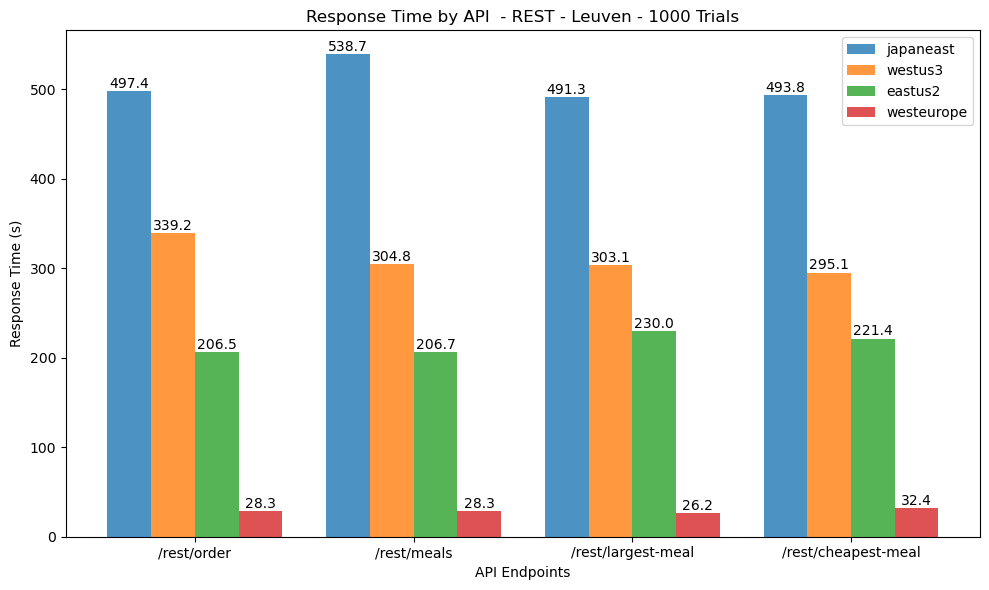
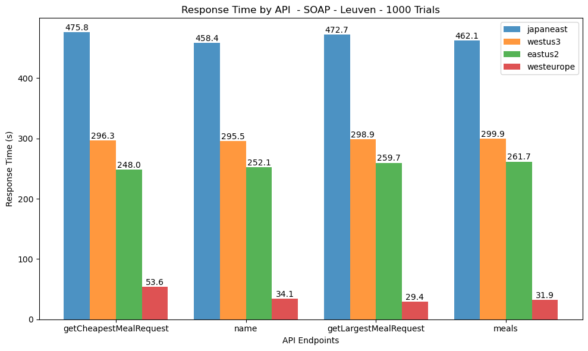
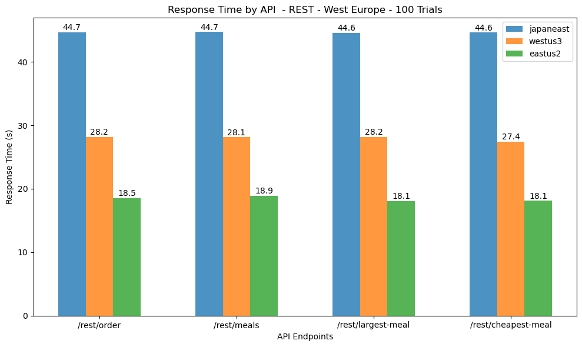
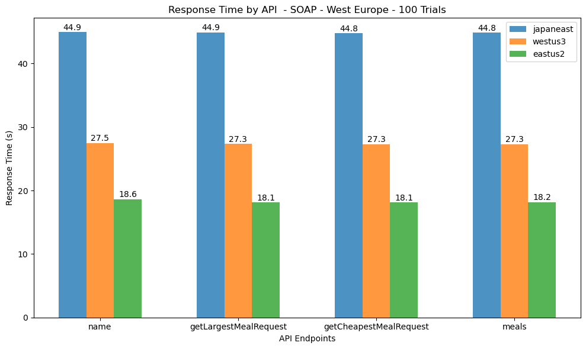
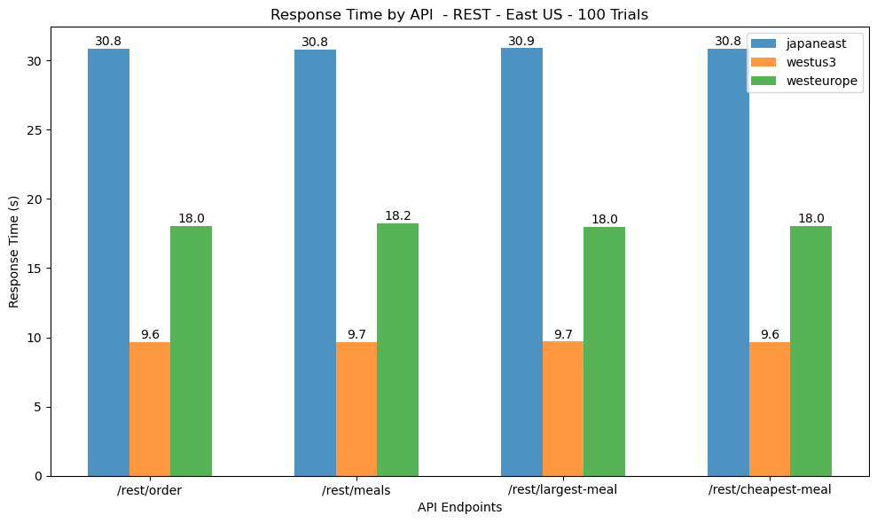
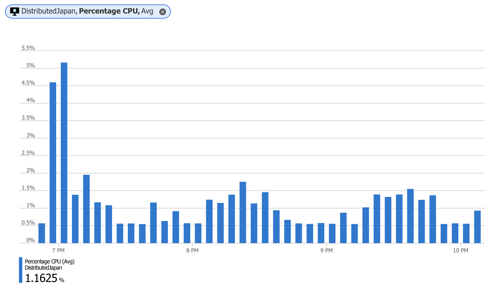
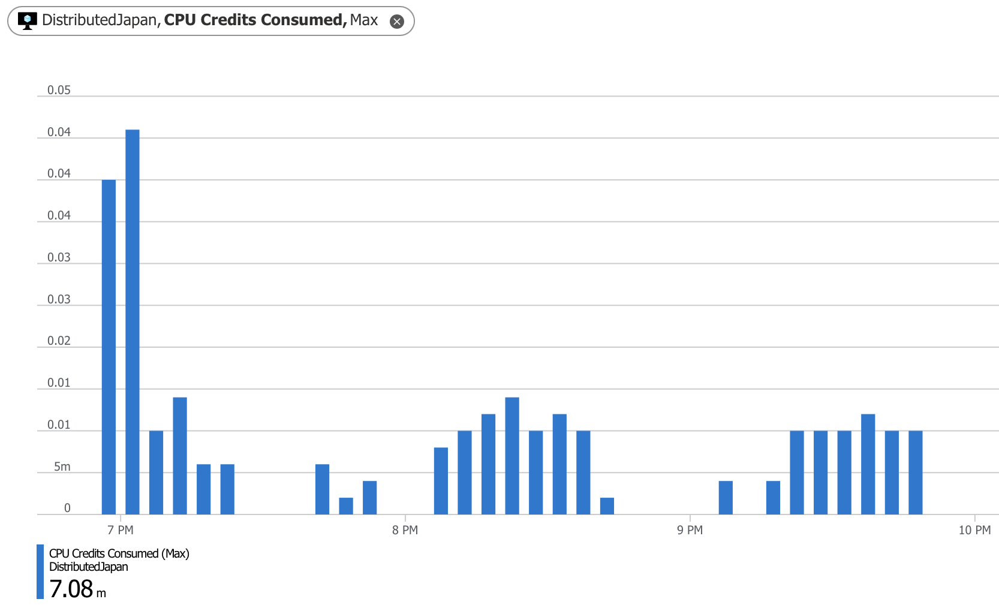

# Project 1: Cloud-based Deployment and Testing

# Code for the Analysis
## Definition of the functions

### Test functions

The function `concurrent_test` is used to test the performance of the API requests. This function sends multiple requests to a server concurrently using Python's ThreadPoolExecutor, and calculates the total response time for each request. The function takes in the DNS, port, list of requests, number of requests, and request type (either REST or SOAP) as inputs. The output is a dictionary containing the total response time for each request.


```python
def parse_soap_elements(xml_str)
def send_rest(url, method, payload=None)
def send_soap(url, data)
def concurrent_test(dns, port, request_list, num_requests, req='REST')
```

### Other Functions


```python
def plot_data(data,num_requests, this_ip, server_list, title='Response Time by API Endpoint and Server', ylabel='Response Time (s)', extra_title=None)
def save_dict_as_pickle_file(dictionary, filename)
def load_dict_from_pickle_file(filename)
```

## Global Variables


```python
server_list = [
    ('alnike.japaneast.cloudapp.azure.com', '20.210.110.130'),
    ('uswest-thiers.westus3.cloudapp.azure.com', '20.106.100.68'),
    ('useast-lennart.eastus2.cloudapp.azure.com', '20.1.139.66'), 
    ('dapps.westeurope.cloudapp.azure.com', '98.71.185.120')
]
```

## Run the REST requests

```python
rest_port = 8081
rest_request_list = [
    ['/rest/order', 'POST', {'address': '123 Main St', 'meals': ['Fish and Chips', 'Steak']}],
    ['/rest/meals', 'GET'],
    ['/rest/largest-meal', 'GET'],
    ['/rest/cheapest-meal', 'GET']
]
```
## Plotting the Time Response for the REST requests

    

## Run the SOAP requests


```python
# read the soap requests from the directory
soap_dir = 'soap_requests'
soap_port = 8082
```

## Plotting the Time Response for the SOAP requests




# Data from the Azure VMs 
## West Europe
### REST Requests - West Europe


### SOAP Requests - West Europe

    


## East US
### REST Requests - East US

    
# Azure Metrics
## Japan East

### CPU Usage


### Credit Usage



# Observations

1. **Geographical Proximity**: The response times are generally shorter when the server is geographically closer to the client. In this case, since the client is running the code from West Europe, the response times for the West Europe server are significantly lower than the response times for servers located in Japan, East US, and West US.

2. **API Type**: REST API response times are generally lower than SOAP API response times due to JSON being more compact and faster to parse than XML used by SOAP APIs. REST APIs also have a simpler message structure.

3. **CPU and Credit Usage**: As expected, Azure's CPU and credit usage increases during request processing.
