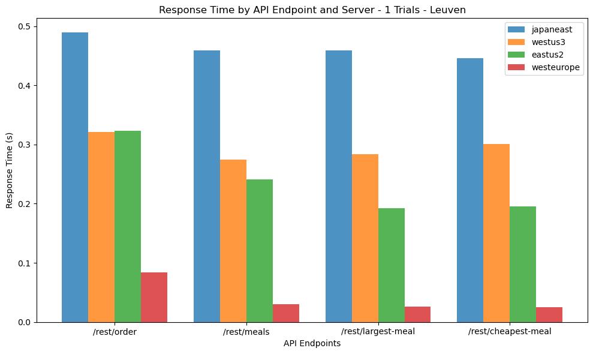
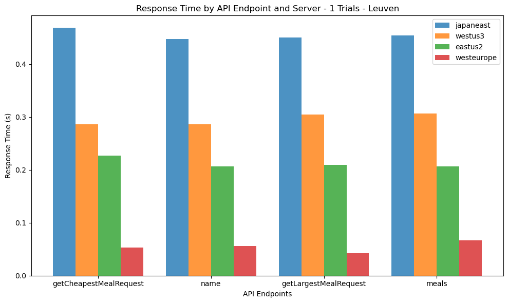

# Distributed Applications
## Project 1: Cloud-based Deployment and Testing

### Group 21:
- Bernardo Maria Avides Moreira Amorim Alves (bernardomaria.avidesmoreiraamorimalv@student.kuleuven.be)
- Alken Rrokaj	(alken.rrokaj@student.kuleuven.be)
- Lennart Steenberghs	(lennart.steenberghs@student.kuleuven.be)
- Michiel Thiers (michiel.thiers@student.kuleuven.be)

## Definition of the functions

### Test functions


```python
def parse_soap_elements(xml_str)
def send_rest(url, method, payload=None)
def send_soap(url, data)
def concurrent_test(dns, port, request_list, num_requests, req='REST')
```

### Other Functions


```python
def plot_data(data,num_requests, this_ip, server_list, title='Response Time by API Endpoint and Server', ylabel='Response Time (s)', extra_title=None)
def save_dict_as_pickle_file(dictionary, filename)
def load_dict_from_pickle_file(filename)
```

## Global Variables


```python
server_list = [
    ('alnike.japaneast.cloudapp.azure.com', '20.210.110.130'),
    ('uswest-thiers.westus3.cloudapp.azure.com', '20.106.100.68'),
    ('useast-lennart.eastus2.cloudapp.azure.com', '20.1.139.66'), 
    ('dapps.westeurope.cloudapp.azure.com', '98.71.185.120')
]

num_requests = 1
this_ip = requests.get('https://api.ipify.org').text
```

## Run the REST requests


```python
rest_port = 8081
rest_request_list = [
    ['/rest/order', 'POST', {'address': '123 Main St', 'meals': ['Fish and Chips', 'Steak']}],
    ['/rest/meals', 'GET'],
    ['/rest/largest-meal', 'GET'],
    ['/rest/cheapest-meal', 'GET']
]

rest_response_times_dict = {}

for dns, ip in server_list:
    # if this is the current server, skip
    if ip == this_ip: continue

    # test REST
    response_times = concurrent_test(dns, rest_port, rest_request_list, num_requests, req='REST')
    
    for url, times in response_times.items():
        if url not in rest_response_times_dict:
            rest_response_times_dict[url] = {}
        rest_response_times_dict[url][dns] = times
    print('\n')
```

    Server: japaneast
    URL: /rest/order, Method: POST, Total Response Time: 0.731
    URL: /rest/meals, Method: GET, Total Response Time: 0.679
    URL: /rest/largest-meal, Method: GET, Total Response Time: 0.536
    URL: /rest/cheapest-meal, Method: GET, Total Response Time: 0.453
    
    
    Server: westus3
    URL: /rest/order, Method: POST, Total Response Time: 0.317
    URL: /rest/meals, Method: GET, Total Response Time: 0.389
    URL: /rest/largest-meal, Method: GET, Total Response Time: 0.345
    URL: /rest/cheapest-meal, Method: GET, Total Response Time: 0.311
    
    
    Server: eastus2
    Request failed: http://useast-lennart.eastus2.cloudapp.azure.com:8081/rest/order
    URL: /rest/order, Method: POST, Total Response Time: 0.267
    Request failed: http://useast-lennart.eastus2.cloudapp.azure.com:8081/rest/meals
    URL: /rest/meals, Method: GET, Total Response Time: 0.101
    Request failed: http://useast-lennart.eastus2.cloudapp.azure.com:8081/rest/largest-meal
    URL: /rest/largest-meal, Method: GET, Total Response Time: 0.14
    Request failed: http://useast-lennart.eastus2.cloudapp.azure.com:8081/rest/cheapest-meal
    URL: /rest/cheapest-meal, Method: GET, Total Response Time: 0.107
    
    
    Server: westeurope
    URL: /rest/order, Method: POST, Total Response Time: 0.051
    URL: /rest/meals, Method: GET, Total Response Time: 0.061
    URL: /rest/largest-meal, Method: GET, Total Response Time: 0.025
    URL: /rest/cheapest-meal, Method: GET, Total Response Time: 0.032
    
    


## Plotting the Time Response for the REST requests


```python
plot_data(rest_response_times_dict, num_requests, this_ip, server_list, extra_title=None);
```


    

    


## Run the SOAP requests


```python
# read the soap requests from the directory
soap_request_list = []
soap_dir = 'soap_requests'
for filename in os.listdir(soap_dir):
    with open(os.path.join(soap_dir, filename), 'r') as f:
        data = f.read()
        soap_request_list.append(['/ws', data.strip()])

soap_port = 8082

# call concurrent_test() with soap_request_list
soap_response_times_dict = {}
for dns, ip in server_list:
    # if this is the current server, skip
    if ip == this_ip: continue

    # test REST or SOAP
    response_times = concurrent_test(dns, soap_port, soap_request_list, num_requests, req='SOAP')
    
    for url, times in response_times.items():
        if url not in soap_response_times_dict:
            soap_response_times_dict[url] = {}
        soap_response_times_dict[url][dns] = times
    print('\n')
```

    Server: japaneast
    URL: getCheapestMealRequest, Method: ('getCheapestMealRequest', None), Total Response Time: 0.673
    URL: name, Method: ('name', 'Portobello'), Total Response Time: 0.544
    URL: getLargestMealRequest, Method: ('getLargestMealRequest', None), Total Response Time: 0.488
    URL: meals, Method: ('meals', 'Steak'), Total Response Time: 0.611
    
    
    Server: westus3
    URL: getCheapestMealRequest, Method: ('getCheapestMealRequest', None), Total Response Time: 0.305
    URL: name, Method: ('name', 'Portobello'), Total Response Time: 0.41
    URL: getLargestMealRequest, Method: ('getLargestMealRequest', None), Total Response Time: 0.451
    URL: meals, Method: ('meals', 'Steak'), Total Response Time: 0.309
    
    
    Server: eastus2
    URL: getCheapestMealRequest, Method: ('getCheapestMealRequest', None), Total Response Time: 0.263
    URL: name, Method: ('name', 'Portobello'), Total Response Time: 0.408
    URL: getLargestMealRequest, Method: ('getLargestMealRequest', None), Total Response Time: 0.211
    URL: meals, Method: ('meals', 'Steak'), Total Response Time: 0.207
    
    
    Server: westeurope
    URL: getCheapestMealRequest, Method: ('getCheapestMealRequest', None), Total Response Time: 0.037
    URL: name, Method: ('name', 'Portobello'), Total Response Time: 0.082
    URL: getLargestMealRequest, Method: ('getLargestMealRequest', None), Total Response Time: 0.084
    URL: meals, Method: ('meals', 'Steak'), Total Response Time: 0.043
    
    


## Plotting the Time Response for the SOAP requests


```python
plot_data(soap_response_times_dict, num_requests, this_ip, server_list, extra_title=None);
```


